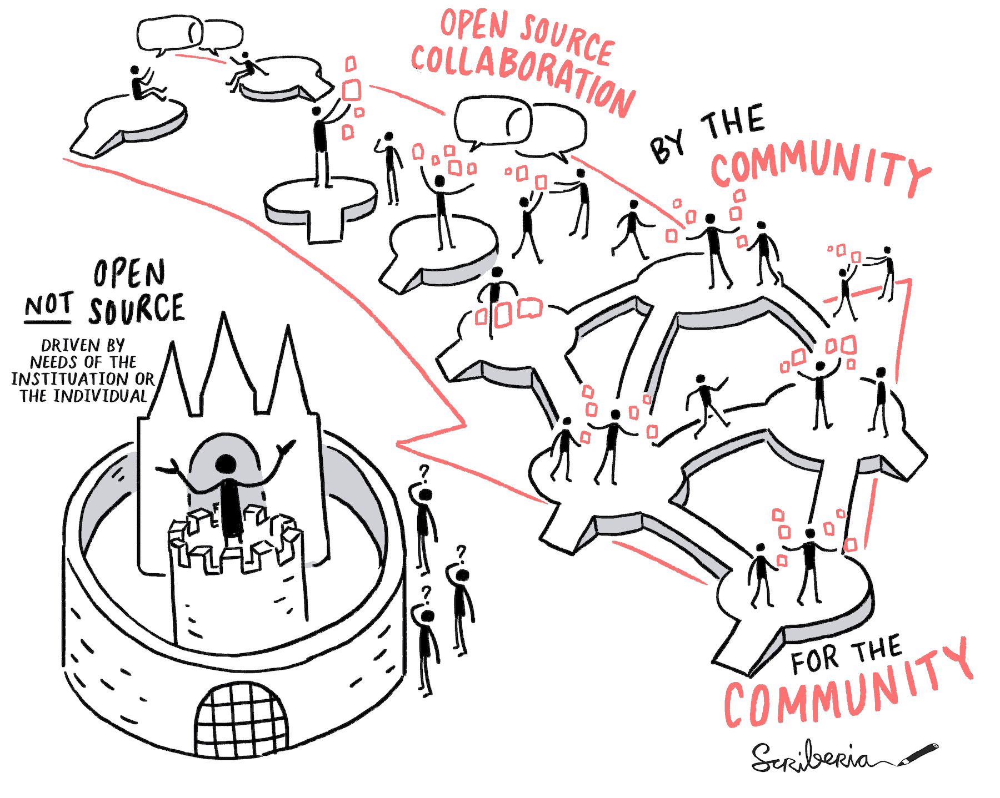

# Open Science for Physicists, Lecture 2, Collaborative Environments

+ Last updated: 7 August 2023
+ Lecturer: @SanliFaez 

#### Contributors: 
+ Erik van Sebille @erikvansebille
+ Hendrik Snijder @hendelhendel

## Main goal: orchestrating a collaborative environment
After this week, one is familiar with the structure of a collaborative environment on Github or Gitlab, and can set a new one up.

from **The Turing Way** chapter [Shared Ownership in Open Source Projects](https://the-turing-way.netlify.app/collaboration/shared-ownership)

### Lecture format

The second lecture will have two parts. The tutorials are executed between the two parts of the lecture, and towards the end of the class.

1. **Good enough data analysis and reporting** 
    40-minutes lecture on best practices for setting up a collaborative research environment based on the course of Dr. Barbara Vreede and [Good enough practices in scientific computing](https://doi.org/10.1371/journal.pcbi.1005510)

2. **Project management**: 
    - Project management and using issues/labels, introduction to Getting Things Done (GTD) boards. 
    - Some tips and suggestions effective collaboration on git platforms and the essentials of community management.

## Tutorials
Between the two lectures, students will be given a complex coding task to complete. The main objective of this exercise is to get a good feeling of what skills it takes to orchestrate a collaborative project within a limited time. 

The programming assignment will be based on analysing experimental data with the laptop sound card and deriving some commong physical properties. Elements of the code are provided to the students in a (poorly-documented) repository. In two separate teams, students should form a code production line that results in a working repository that works on every individual PC.

After the second lecture, students are guided to finish their coding assignment based on a suitably organized repository. 

### Related concepts
Unit testing (defensive programming) | Version control | Active and passive versioning | Readme files and templates | Merging forked repositories

## Information Sources / Bibliography  

+ Introduction to Github; [Git and Github for Poets](https://www.youtube.com/playlist?list=PLRqwX-V7Uu6ZF9C0YMKuns9sLDzK6zoiV)
+ Version control; Blischak JD, Davenport ER, Wilson G (2016) A Quick Introduction to Version Control with Git and GitHub. [PLOS Computational Biology 12: e1004668](https://doi.org/10.1371/journal.pcbi.1004668)  
+ Project management and [Getting Things Done](https://gettingthingsdone.com/what-is-gtd/) (GTD)
+ [Building communities](https://mozilla.github.io/open-leadership-training-series/articles/building-communities-of-contributors/) part of the Mozilla Open Leadership course 
+ [Building healthy leadership skills](https://the-turing-way.netlify.app/collaboration/leadership/leadership-building)
+ [Principles of democratic structuring](https://www.jofreeman.com/joreen/tyranny.htm), from Jo Freeman's famous essay: The Tyranny of Structurelessness