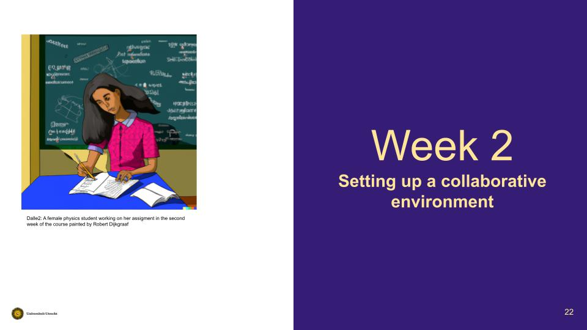

# Open Science for Physicists, Lecture 2, Collaborative environments
Course Development Week 2 for the Open Science Course for physics students at graduate level. This document is based on the Syllabus.MD.

+ Last updated Date: 05/09/2022
+ Lecturer: @SanliFaez 

#### Contributors: 
+ Erik van Sebille @erikvansebille
+ Hendrik Snijder @hendelhendel

## Goal: setting up a collaborative environment
After this week, one is familiar with the structure of a collaborative environment on Github or Gitlab, and can set a new one up.

## Lecture: Week 2 

This week's lecture will have two parts. 

1. **Good enough data analysis and reporting** 
    + 30-40 minutes lecture on best practices for setting up a collaborative research environment based on the course of Barbara Vreede and [this article](https://journals.plos.org/ploscompbiol/article?id=10.1371/journal.pcbi.1005510&ref=https://githubhelp.com)

2. **Project management**: 
    + Project management and using issues/labels, introduction to Getting Things Done (GTD) boards. 
    + Some tips and suggestions effective collaboration and project managment on git platforms

## Tutorial: Week 2
+ During the dutorial, students will be given a complex coding task to complete in multiple teams, starting from forking an incomplete repository and then making the complete project work as a group! 
+ To make sure that every student practices the basic git commands, every student is asked to to run the final program on their PC

### Tutorial format
**Assignment objective: learning about collaborative project development from practice**

The programming assignment will be based on analysing experimental data with the laptop sound card and doing an experiment with Doppler shift. Elements of the code are provided to the students in a [poorly-documented directory](../Week2/mycode). Students are divided into 4 teams of about 20+ and each team should make the code useful for analyzing a new measurement. The main goal is to create a well documented repository that works on every individual PC.

**Assignment preparation**
  + Students have to discuss in a teams on distribution of task, timing of their execution and how they are working and communication with each other. 
  + Each team should present a code and code structure that can analyze newly recorded data in the shortest time and present a final result that has the highest accuracy.
  + Each team will reserve one fresh laptop for the finale,  
  
  **Playful finale**
In this part, the reserved laptops will be used in a competition between the representatives of each team. The team representative that can install and run the code the fastest will be the winning team.

### Other keywords related to this lecture
Unit testing (defensive programming) | Version control | Active and passive versioning | Readme files and templates | Merging forked repositories

## Information Sources / Bibliography
+ Licensing and receiving credit
  + https://www.youtube.com/watch?v=vAQghXQApPU 
+ Best Practices for Community management
  + Expert on Community management?
+ Project management and Getting Things Done (GTD)
  + https://gettingthingsdone.com/resources/ 
+ Version control
  +  Blischak JD, Davenport ER, Wilson G (2016) A Quick Introduction to Version Control with Git and GitHub. PLOS Computational Biology 12(1): e1004668. https://doi.org/10.1371/journal.pcbi.1004668 
+ Introduction to Github 
  + https://www.youtube.com/playlist?list=PLRqwX-V7Uu6ZF9C0YMKuns9sLDzK6zoiV
