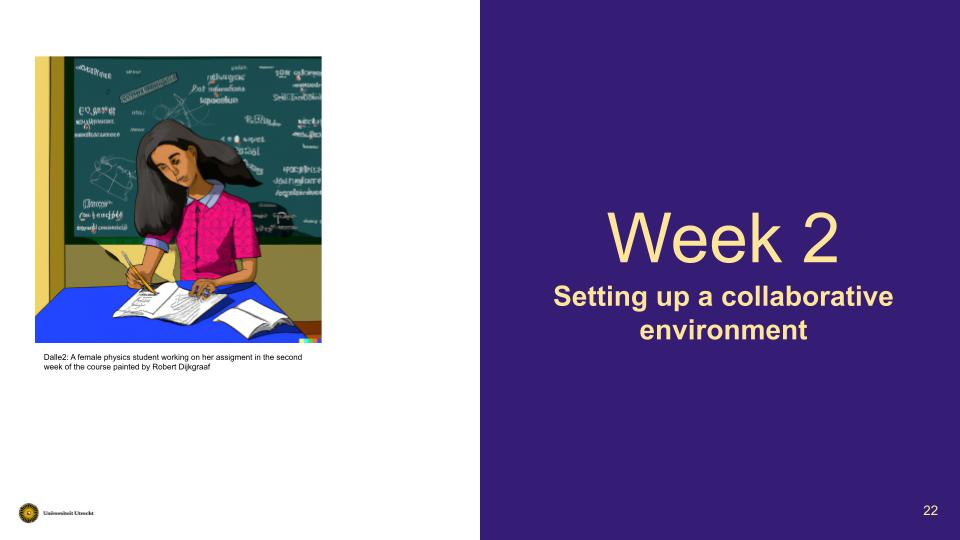

# Open Science for Physicists, Lecture 2, Collaborative environments
Course Development Week 2 for the Open Science Course for physics students at graduate level. This document is based on the Syllabus.MD.

+ Last updated Date: 05/06/2022
+ Lecturer: @SanliFaez 

#### Contributors: 
+ Erik van Sebille @erikvansebille
+ Hendrik Snijder @hendelhendel

## Goal: setting up a collaborative environment
After this week, one is familiar with the structure of a collaborative environment on Github or Gitlab, and can set a new one up.

## Keywords student familiarity check week 2
Some of the keywords in [syllabus](./syllabus.md) are supposed to be new, while some are most probably familiar for students.

/* To BE DISCUSSED, should we do this for each lecture? Will it work in the first trial?*/
|**New Concepts**|**Familiar Concepts**|
|----------------|---------------|
| Licensing and receiving credit | Version control |
| Best Practices for Community management | Active and passive versioning |
| Project management and Getting Things Done (GTD) | Readme files and templates |
| Unit testing (defensive programming) | Merging forked repositorie |

## Lecture: Week 2 
**Topics in lecture**

Licensing and receiving credit | Best Practices for Community management | Project management and Getting Things Done (GTD)

### Lecture format

The second lecture will have two parts. I

1. **Good enough data analysis and reporting** 
    30-40 minutes lecture on best practices for setting up a collaborative research environment based on the course of Barbara Vreede and this article

2. **Project management**: 
    - Project management and using issues/labels, introduction to Getting Things Done (GTD) boards. 
    - Some tips and suggestions effective collaboration and project managment on git platforms

## Tutorial: Week 2
**Topics in tutorial:**
- Between the two lecture, students will be given a complex coding task to complete in two teams, starting from forking an incomplete repository and make the complete project work as a group! 
- To make sure that every student practices the basic git commands, every student must be able to run the final program on their PC

/* To BE DISCUSSED, can we cover all these concept in one session? */

Unit testing (defensive programming) | Version control | Active and passive versioning (?) | Readme files and templates | Merging forked repositories

### Tutorial format
**Assignment objective**
This is a concept exercise. A practical example has to be developed.

To practise with the topics above, the students are invited to fork the repository of the lecture. This repository contains the videos and links discribed and 1 python program with 4 parts. The groups are the same as in the first tutorial. Every group gets a specific task, see possible deliverables. 

This repository can be created every year again or it can be a growing repository, with lots of different projects on the topics of week 2. 

**Possible deliverables**
  1. All groups have to test a part of the python software. Some specific changes in the software has to be made.

  2. Each group can choose between:
      1. Some groups can search for an open source initatives. They try to track down the workflows and they try to add something. The workflow are combined in a .MD file and added to the forked repository. In this way the students can practise with version control and with crediting another project.
      2. Some groups can search for open source data sets and try to visualize them in a fancy way. The group have to calculate something new with the existing data. The new data set can be stored on the repository, which then can be pulled. In this way students can practis with version control
      3.  Some groups can search for an open source AI, such as DALLE-2 or craiyon. With this software, students are going to study a topic they like in a systematic way by changing the input a bit. After every iteration, they ask for a pull request on pulling the results on the repopsitory. In this way the students can practise with version control and with crediting another project.As an example, they can ask dalle-2 the following: 
            +  first iteration: "An apple with a blue hat and two legs cycling on a bike in front of the empire state building, painted by dali."
            +  second iteration: "An pine-apple with a blue hat and two legs cycling on a bike in front of the empire state building, painted by dali."
            +  ...
 
**Assignment preparation**
  + Students have to discuss in a teams on distribution of task, timing and how they are working together
  + ..

## Information Sources / Bibliography
+ Licensing and receiving credit
  + https://www.youtube.com/watch?v=vAQghXQApPU 
+ Best Practices for Community management
  + Expert on Community managemen?
+ Project management and Getting Things Done (GTD)
  + https://gettingthingsdone.com/resources/ 
+ Version control
  +  Blischak JD, Davenport ER, Wilson G (2016) A Quick Introduction to Version Control with Git and GitHub. PLOS Computational Biology 12(1): e1004668. https://doi.org/10.1371/journal.pcbi.1004668 
+ Introduction to Github 
  + https://www.youtube.com/playlist?list=PLRqwX-V7Uu6ZF9C0YMKuns9sLDzK6zoiV
