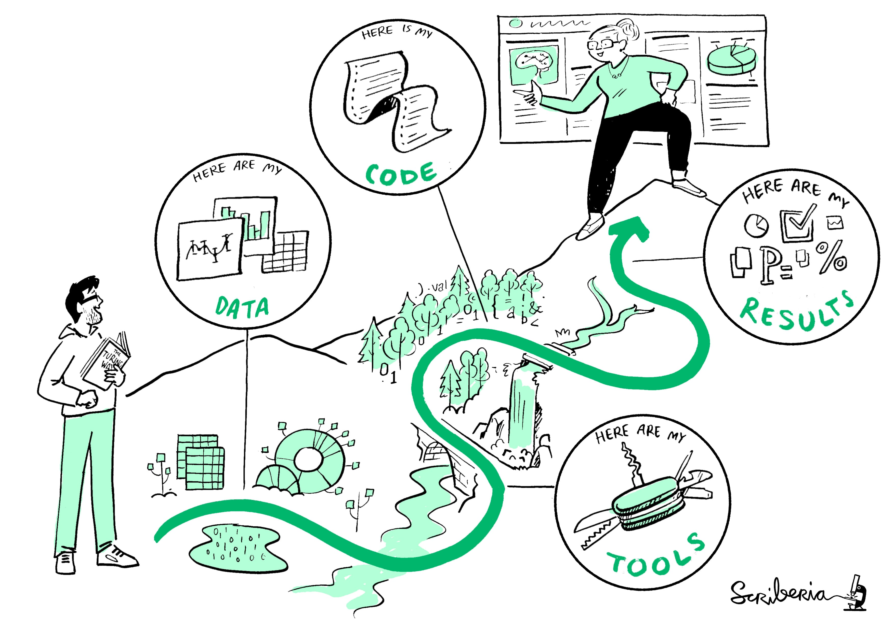

# Open Science for Physicists, Lecture 7, Documentation for reproducibility

+ Last updated: 29 08 2024
+ Lecturer: e.g. @SanliFaez 

#### Contributors: 
+ Sjoerd Terpstra @TerpstraS

## Development goal
Obtaining an intrinsic motivation to documenting the project for replication and reproducibility

[The Turing Way project](https://the-turing-way.netlify.app/reproducible-research/reproducible-research) illustration by Scriberia. Used under a CC-BY 4.0 licence. DOI: 10.5281/zenodo.3332807.

Student teams aim to reproduce a project from their peers from week 4. They will also review the documentation of the project and their experiences with reproducing the experiment.

## Motivation: 
Journaling and reporting, to self or colleagues, are a essential part of the scientific inquiry and an undismissible part of the credibility cycles. 
Translating the higher goals of open science to daily practices of each researcher means documentation should be taken very seriously and thoroughly.

Despite practicing reporting from high school in almost every project, several aspects of writing a report aimed at reproducibility stay neglected. Here are some
anecdotes from the feedback that student gave each other last year:

+ Positive:
    + Everything is in the expected files. The project documentation structure is clear.
    + It is the first thing the eyes of the reader fall on. The provided information is concise, but precise as well
    + They encouraged us and the procedure is easy enough, although the measurements and the analysis itself was not really motivating.
+ Critical:
    + 'This should be like following a recipe to bake a cake, not like a investigation into a crime.' It took far too much effort to figure out what you did and then how you did what you did for anyone to WANT to reproduce it.
    + No issues whatsoever in reproducing.
    + We got stuck, because useful information that was present in the project description of the Git was not present in the README project.
    
What type of feedback do you feel you will get for your documentation? 

## Vision of outcome
By following the review exercise, each student will look criticaly at the documentation written by others and from the feedback they recieve will feel how their own documentation could have been imrpoved.

Good documentation is mostly an exercise in empathy, and experiencing that feeling is the main goal of the exercise of this lecture. 

## Embedding/community
A documentation that is geared for reproducibility can helps:
+ Your collaborators that need to verify or build upon your work
+ (Yet) unidentified users of your project outcome that need to understand the context and methods
+ You, yourself, in a few months when you have to re-open or re-use these results for the publication process or a next chapter in reserach

## Methods
Students have to reproduce the projects of another team, solely based on their documentation, and write are report based on [this template](../Resources/peer_evaluation_FORWHICHPROJECT.md). This exercise will take about 75 minutes. Review teams will be assigned by the course TAs and one representative of each team will be assigned to the issue corresponding to the project their team must review.

## Evaluation

After performing the review exercise, we will discuss in the groups the lessons we have learn and the take-aways for implementing in our next projects.

## Guidelines
Here is a collection of points based on past experiences of practicing researchers with an open science mindset.

This is a summary of [best documentation practices by Wilson et al. ](https://doi.org/10.1371/journal.pcbi.1005510)

a. **Data management**
  + Save the raw data. 
  + Ensure that raw data are backed up in more than one location. 
  + Create the data you wish to see in the world. 
  + Create analysis-friendly data. 
  + Record all the steps used to process data. 
  + Anticipate the need to use multiple tables, and use a unique identifier for every record. 
  + Submit data to a reputable DOI-issuing repository so that others can access and cite it.

b. **Software**
  + Place a brief explanatory comment at the start of every program. 
  + Decompose programs into functions. 
  + Be ruthless about eliminating duplication. 
  + Always search for well-maintained software libraries that do what you need. 
  + Test libraries before relying on them. 
  + Give functions and variables meaningful names. 
  + Make dependencies and requirements explicit. 
  + Do not comment and uncomment sections of code to control a program's behavior.
  + Provide a simple example or test data set. 
  + Submit code to a reputable DOI-issuing repository.

c. **Collaboration**
  + Create an overview of your project. 
  + Create a shared "to-do" list for the project. 
  + Decide on communication strategies. 
  + **Make the license explicit.**
  + Make the project citable. 

d. **Project organization**
  + **Put each project in its own directory, which is named after the project.** 
  + Put text documents associated with the project in the `/doc` directory. 
  + Put raw data and metadata in a data directory and files generated during cleanup and analysis in a results directory. 
  + Put project source code in the src directory. 
  + Put external scripts or compiled programs in the bin directory. 
  + Name all files to reflect their content or function.
   
e. **Keeping track of changes** 
  + Back up (almost) everything created by a human being as soon as it is created. 
  + Keep changes small. 
  + Share changes frequently. 
  + Create, maintain, and use a checklist for saving and sharing changes to the project.
  + Store each project in a folder that is mirrored off the researcher's working machine. 
  + Add a file called CHANGELOG.txt to the project's docs subfolder. 
  + Copy the entire project whenever a significant change has been made. 
  + Use a version control system.

 f. **Manuscripts and reports**
   + Write manuscripts using online tools with rich formatting, change tracking, and reference management. 
   + Write the manuscript in a plain text format that permits version control.